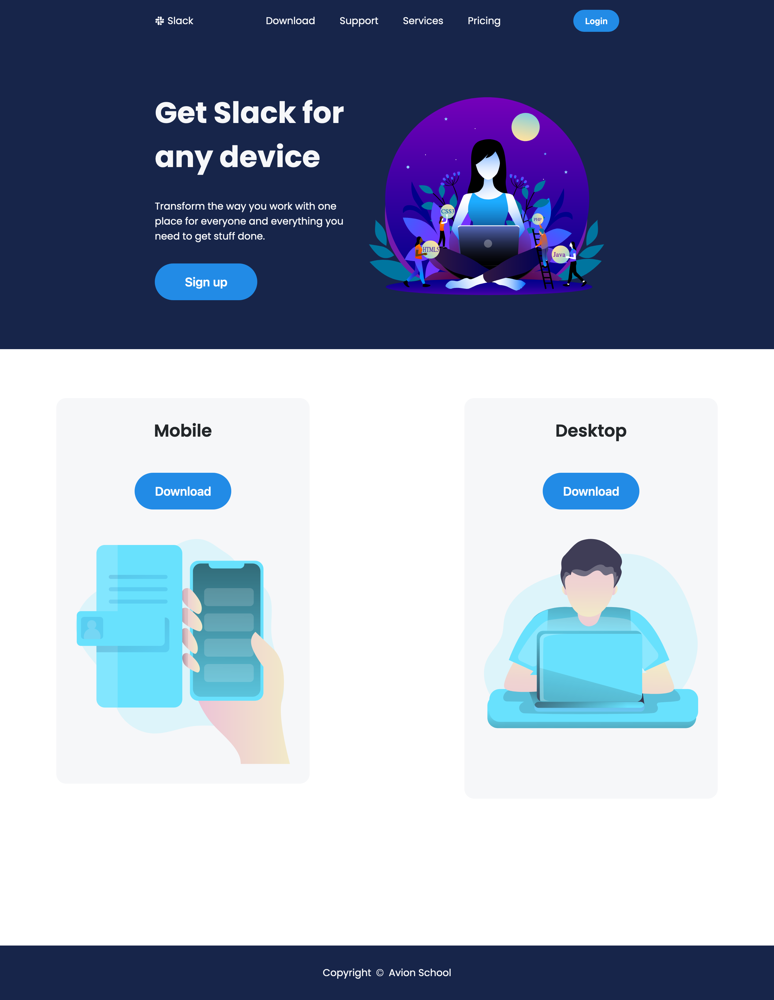
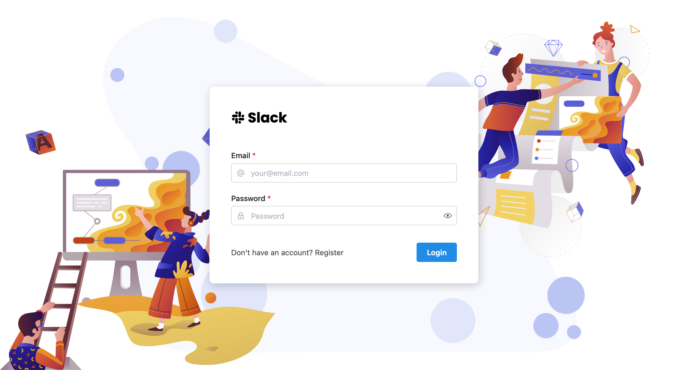
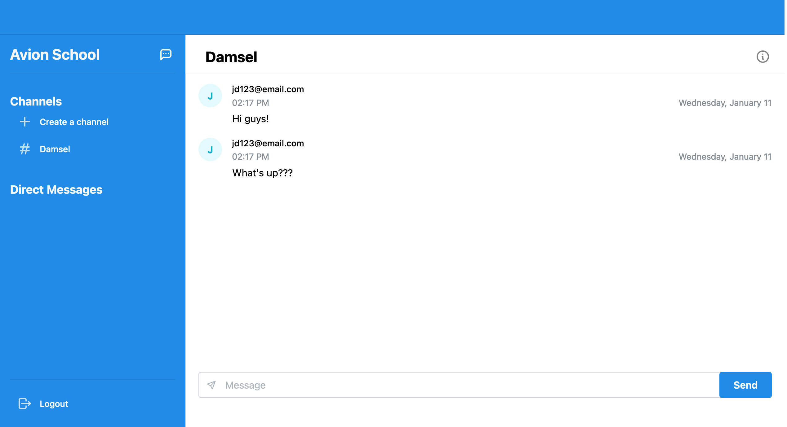

# Slack Clone App

A ReactJS application that allows users to create or join a group chat and send a private message to anyone.

## Tech Stack

- React
- Sass

## User Login

**Important Note:** Due to API limitation, enable mixed content in your browser to access the application. Refer to the link below.

email: `jd123@email.com`  
password: `password`

## Live Demo

Vercel (https://slack-app-rho.vercel.app)  
Enabling mixed content in your browser (https://experienceleague.adobe.com/docs/target/using/experiences/vec/troubleshoot-composer/mixed-content.html?lang=en)
